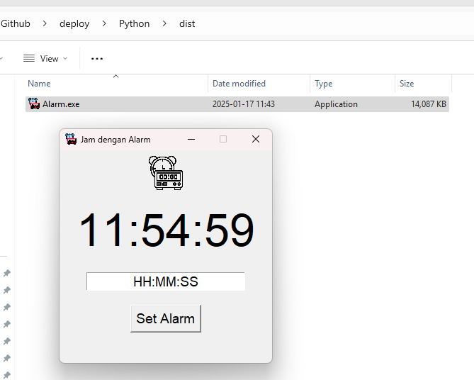

# Deploy

## Python ke EXE

### Requirements
- Python 3.x : https://www.python.org/ftp/python/3.13.1/python-3.13.1-amd64.exe
- Visual Studio Code : https://code.visualstudio.com/sha/download?build=stable&os=win32-arm64-user 

- pip
Jika Python meminta untuk upgdare pip, jalankan ini:
``` bash
python.exe -m pip install --upgrade pip
```

- pyinstaller : 

Setelah mengunduh dan melakukan instalasi Python, buka Command Prompt (Run as Administrator) jalankan perintah: 
``` bash
pip install pyinstaller
```

- pysound :
``` bash
pip install playsound
```

- pygame :
``` bash
pip install pygame
```

- pillow :
``` bash
pip install pillow
```

Tutup Command Prompt.

### Program

Buka kembali Command Prompt, tentukan lokasi proyek lalu jalankan Visual Studio Code:
``` bash
code Alarm.py
```

Tuliskan Kode berikut:
``` python
import tkinter as tk
from tkinter import messagebox
import datetime
import threading
import time
import winsound
import os
import sys
from PIL import Image, ImageTk

# Menentukan path file berdasarkan apakah kita berada dalam lingkungan onefile atau tidak
def resource_path(relative_path):
    try:
        # Untuk aplikasi yang dibundle dengan PyInstaller
        base_path = sys._MEIPASS
    except Exception:
        # Untuk saat aplikasi dijalankan dari sumber
        base_path = os.path.abspath(".")
    
    return os.path.join(base_path, relative_path)

# Fungsi untuk memvalidasi waktu alarm
def validate_time(time_str):
    try:
        time_obj = datetime.datetime.strptime(time_str, "%H:%M:%S")
        return time_obj
    except ValueError:
        return None

# Fungsi untuk memperbarui jam
def update_time():
    current_time = datetime.datetime.now().strftime("%H:%M:%S")
    clock_label.config(text=current_time)
    root.after(1000, update_time)  # Update every second

# Fungsi untuk memeriksa alarm
def check_alarm():
    while True:
        now = datetime.datetime.now().strftime("%H:%M:%S")
        if now == alarm_time.get():
            play_alarm_sound()  # Memutar suara alarm
            messagebox.showinfo("Alarm", "Alarm Berbunyi!")
            alarm_time.set("")  # Reset alarm setelah berbunyi
        time.sleep(1)

# Fungsi untuk memutar suara alarm
def play_alarm_sound():
    try:
        if os.path.exists(resource_path("alarm_sound.wav")):
            winsound.PlaySound(resource_path("alarm_sound.wav"), winsound.SND_FILENAME)
        else:
            print("Alarm sound file not found!")
    except Exception as e:
        print(f"Error memutar suara: {e}")

# Fungsi untuk memulai alarm
def start_alarm():
    alarm = validate_time(alarm_time.get())
    if alarm:
        threading.Thread(target=check_alarm, daemon=True).start()
        messagebox.showinfo("Info", f"Alarm disetel untuk pukul {alarm_time.get()}")
    else:
        messagebox.showerror("Error", "Format waktu tidak valid! Gunakan HH:MM:SS")

# Inisialisasi antarmuka pengguna
root = tk.Tk()
root.title("Jam dengan Alarm")
root.geometry("300x300")
root.resizable(False, False)

# Tambahkan ikon aplikasi (gunakan file .ico jika tersedia)
try:
    root.iconbitmap(resource_path("icon.ico"))
except Exception as e:
    print(f"Error setting icon: {e}")

# Memuat ikon untuk label
try:
    icon_image = Image.open(resource_path("icon.png"))
    icon_image = icon_image.resize((50, 50), Image.Resampling.LANCZOS)
    icon_photo = ImageTk.PhotoImage(icon_image)
    icon_label = tk.Label(root, image=icon_photo)
    icon_label.pack(pady=5)
except FileNotFoundError:
    icon_label = tk.Label(root, text="[Icon Not Found]", font=("Helvetica", 10))
    icon_label.pack(pady=5)

# Label untuk jam
clock_label = tk.Label(root, text="--:--:--", font=("Helvetica", 48))
clock_label.pack(pady=10)

# Entry untuk waktu alarm
alarm_time = tk.StringVar()
alarm_entry = tk.Entry(root, textvariable=alarm_time, font=("Helvetica", 14), justify="center")
alarm_entry.pack(pady=10)
alarm_entry.insert(0, "HH:MM:SS")

# Tombol untuk menyetel alarm
set_alarm_button = tk.Button(root, text="Set Alarm", font=("Helvetica", 14), command=start_alarm)
set_alarm_button.pack(pady=10)

# Jalankan thread untuk memperbarui waktu
update_time()

# Jalankan aplikasi
root.mainloop()

```

- Unduh icon dari sini : https://icon-icons.com/downloadimage.php?id=108740&root=1617/ICO/512/&file=3700456-alarm-clock-date-time-timer-tools_108740.ico dan jangan lupa rename menjadi icon.ico.

- Unduh icon untuk label : https://icon-icons.com/downloadimage.php?id=108786&root=1618/PNG/512/&file=3700425-alarm-clock-date-time-timer-tools_108786.png dan jangan lupa rename menjadi icon.png.

- Unduh file untuk audio : https://mixkit.co/ dan ubah namanya menjadi alarm_sound.wav

- Tempatkan di folder yang sama dengan file Alarm.py


### Test
Uji program:
``` bash
python Alarm.py 
```

### Build

Jalankan perintah berikut:
``` bash
pyinstaller --onefile --windowed --icon=icon.ico --add-data "alarm_sound.wav;." --add-data "icon.png;." --add-data "icon.ico;." Alarm.py
```

Jika tidak berhasil karena pyinstaller tidak terdaftar di path, coba ini:
``` bash
python -m PyInstaller --onefile --windowed --icon=icon.ico --add-data "alarm_sound.wav;." --add-data "icon.png;." --add-data "icon.ico;." Alarm.py

```

Hasil build dapat dilihat di dalam folder dist.

